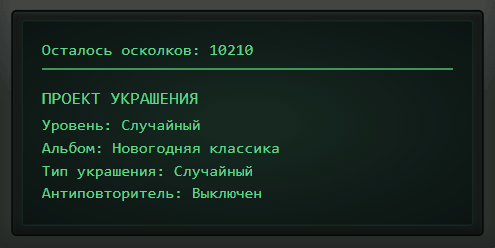

# Newyear Decor Collider

**Новогодний Коллайдер** — клиентская SPA-панель управления выдуманным новогодним прибором, который превращает внутриигровые осколки в праздничные украшения.

<p align="center">
  
</p>

## О проекте

Игрок получает осколки через ежедневный календарь, тратит их в коллайдере на создание украшений, хранит созданные предметы в инвентаре и открывает уникальные позиции в книге коллекций. Прогресс хранится в localStorage.

Основные части приложения:

- `/collider` — главный экран прибора с аналоговой панелью, настройками рецепта и запуском крафта.
- `/collider?panel=inventory` — инвентарь в нижней выдвижной панели с механикой утилизации предметов.
- `/collider?panel=collection` — книга коллекций в правой выдвижной панели с прогрессом по альбомам.
- `/calendar` — ежедневный календарь наград с time-lock логикой и сезонным сбросом месяца.

## Технологии

- ⚛️ **React 19.2** — основа пользовательского интерфейса.
- 🟦 **TypeScript 6** — строгая типизация приложения и доменной логики.
- ⚡ **Vite 8** — dev-сервер, сборка и быстрый HMR.
- 📦 **pnpm** — установка зависимостей и запуск проектных скриптов.
- 🧭 **React Router 7** — маршрутизация между экранами приложения.
- 🎨 **SCSS Modules** — локальные стили компонентов без UI-библиотек.
- 🧹 **ESLint + Prettier** — проверка качества кода и единое форматирование.

## Архитектура

Код организуется по принципам FSD. Ниже перечислены только слои и директории, которые уже используются в проекте или напрямую предусмотрены текущей спецификацией:

- `src/app` — инициализация приложения, роутер, глобальные стили и layout-компоненты.
- `src/pages` — страницы маршрутов календаря и коллайдера.
- `src/widgets` — самостоятельные составные блоки интерфейса, включая панели инвентаря и коллекции.
- `src/features` — пользовательские действия и фичи, например транзакция крафта украшения.
- `src/entities` — доменные сущности проекта, например постоянный прогресс игрока.
- `src/shared/lib` — чистые функции, конфиги, реестры и доменные helper-ы без React-зависимостей.
- `src/shared/ui` — переиспользуемые UI-компоненты без привязки к конкретной странице.

## Быстрый старт

```bash
pnpm install
pnpm dev
```

После запуска приложение доступно на локальном адресе, который выведет Vite.

## Скрипты

- `pnpm dev` — запуск dev-сервера.
- `pnpm build` — проверка TypeScript и production-сборка.
- `pnpm preview` — локальный просмотр production-сборки.
- `pnpm type-check` — проверка типов без сборки.
- `pnpm lint` — запуск ESLint.
- `pnpm lint:fix` — автоматическое исправление доступных ESLint-ошибок.
- `pnpm format` — форматирование Prettier.
- `pnpm format:check` — проверка форматирования.

## Документация

Проектная логика описана в `docs`. Документация находится в процессе развития и может меняться:

- `docs/01-project-core.md` — глобальный стейт, localStorage, навигация и роутинг.
- `docs/02-daily-calendar.md` — ежедневный календарь, пропуски, time-lock и сброс месяца.
- `docs/03-collider.md` — элементы управления коллайдером, инварианты и формула цены.
- `docs/03a-collider-canvas.md` — правила отображения холста и масштабирования прибора.
- `docs/04-collection-book.md` — инвентарь, книга коллекций, фильтрация наград и антиповторитель.
- `docs/CODE_STYLE.md` — архитектурные правила, стиль кода и формат коммитов.
